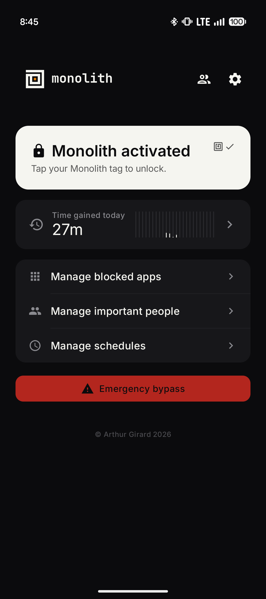
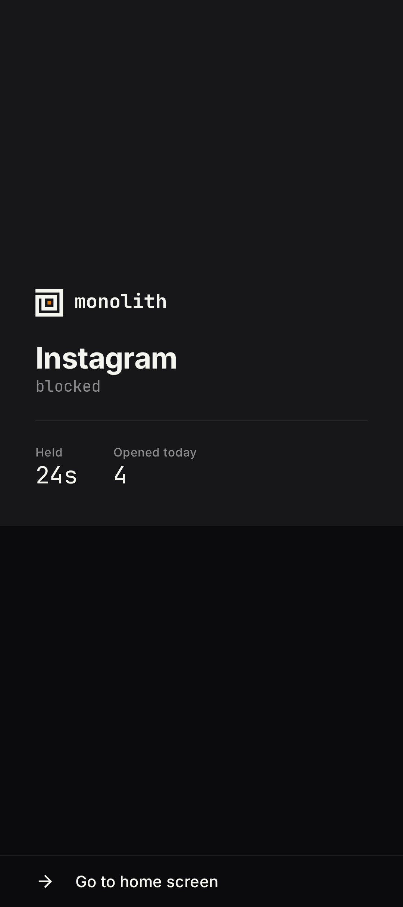
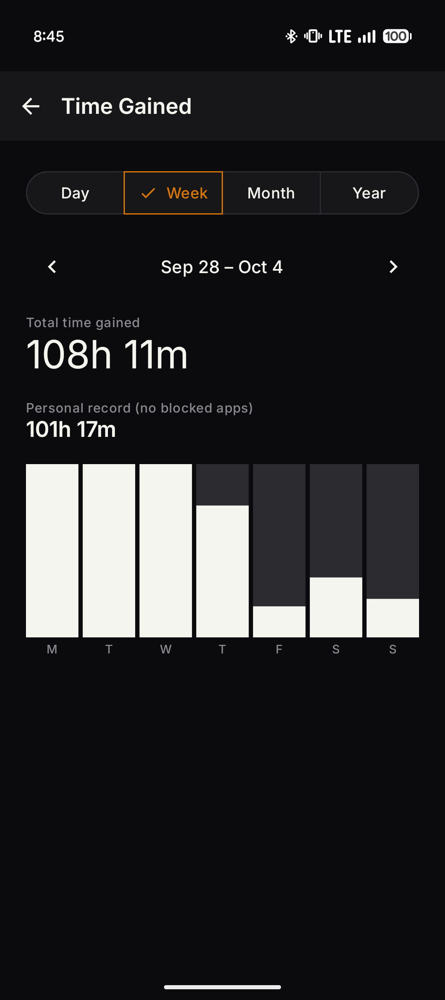
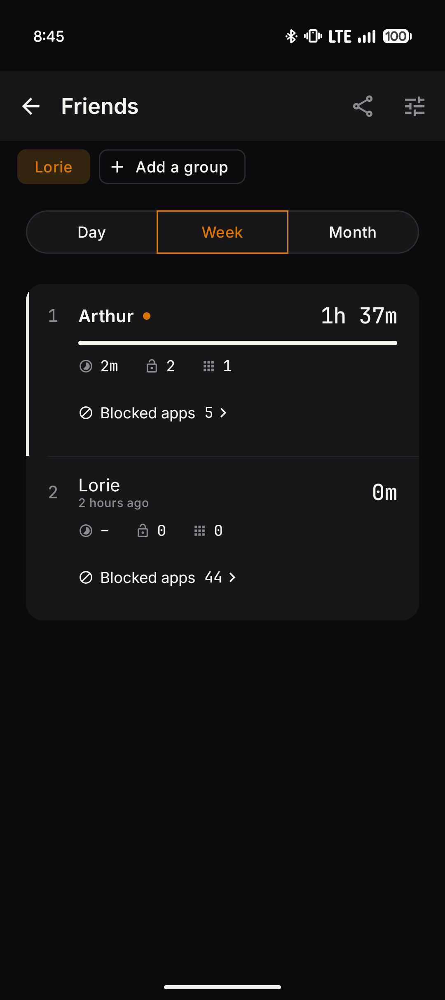
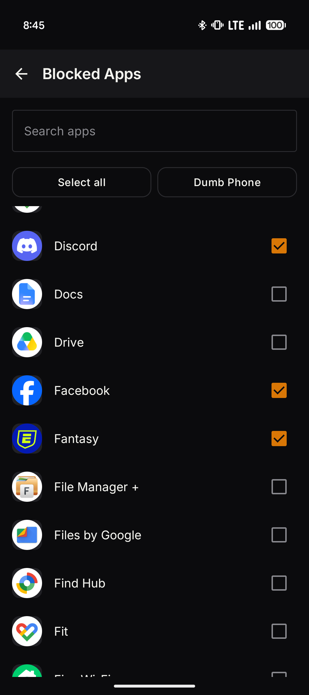
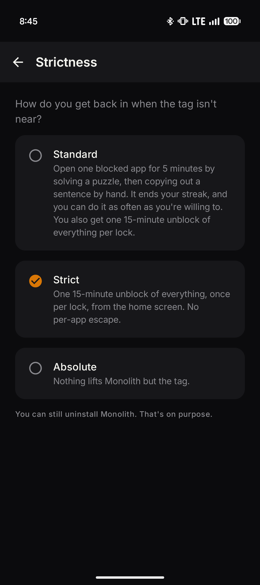
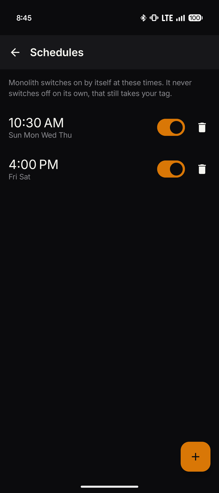
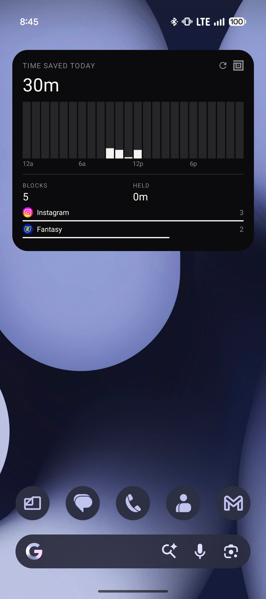

<p align="center">
  <picture>
    <source media="(prefers-color-scheme: dark)" srcset="assets/logo/banner.svg">
    
  </picture>
</p>

<p align="center">
  <a href="https://github.com/arthgirard/monolith/releases/latest"></a>
  
  <a href="LICENSE"></a>
</p>

An NFC tag as a physical switch for the apps you keep opening out of habit. Tap the tag and the
apps you picked are blocked. Tap it again and they come back. There is no switch in the app to
turn blocking off: getting up to find the tag is the point.

## Screenshots

<table>
  <tr>
    <td></td>
    <td></td>
    <td></td>
    <td></td>
  </tr>
  <tr>
    <td></td>
    <td></td>
    <td></td>
    <td></td>
  </tr>
</table>

## Install

Monolith is not on the Play Store. Download the latest APK from
[Releases](https://github.com/arthgirard/monolith/releases/latest) and open it on your phone.
After that, the app checks GitHub for new versions itself and installs them for you.

You need an Android phone with NFC (Android 8.0 or newer) and an NFC tag. Any cheap NTAG sticker
works.

## Features

**The tag is the switch.** Link a tag once and every tap turns Monolith on or off. While it is
on, the app list, important people and restore are locked, so nothing in the app can undo it.

**Blocking that holds.** A blocked app is covered by a full-screen wall the moment it opens, and
its notifications never reach the shade. Android Settings is covered too, so the services can't
be switched off to escape.

**Strictness you choose.** For when the tag isn't near:

- *Standard:* open one app for 5 minutes by solving a puzzle and copying out a sentence by hand.
  It ends your streak. You also get one 15-minute bypass of everything per lock.
- *Strict:* only the one 15-minute bypass per lock.
- *Absolute:* nothing but the tag.

**Schedules.** Monolith can turn itself on at set times and days. It never turns itself off:
that still takes the tag.

**Important people.** Let notifications from specific names or handles through, per app, even
while that app is blocked.

**Dumb phone mode.** One button blocks every app except your messages, phone and clock.

**Time gained.** Every minute Monolith spends blocking is counted and broken down by day, week,
month and year, with your running total and personal record.

**Home screen widget.** Today's time gained, hour by hour. Make it taller to add today's blocks,
your streak, and the apps you reached for most.

**Friends.** Create or join a group with an invite code and compare time gained, streaks,
bypasses and blocked apps. You choose what each group sees, and a stat you hide stays hidden from
you too. Your group always sees whether Monolith is on.

**Encrypted backup.** History and setup are backed up automatically, encrypted on your phone
with a recovery code the server never sees. The code is saved to your tag as well, so tapping it
while setting up a new phone brings everything back.

**Seven languages.** English, French, German, Spanish, Italian, Dutch and Brazilian Portuguese.

## How it works

**Linking a tag.** Monolith writes a `monolith://tag/<uid>` record to the tag, so a tap opens the
app directly. A tag that can't be written still works: Monolith falls back to matching its
hardware ID. A writable tag also carries your recovery code, encrypted with a key derived from
that tag's ID, so a copy of what is written on it is useless without the tag itself.

**Enforcement.** An Accessibility Service watches which app comes to the front and puts up the
block wall. A Notification Listener cancels notifications from blocked apps, letting through the
ones that match an important person's name or handle. A foreground service keeps both running,
and Monolith tells you if Android takes a permission back.

**Permissions.** Setup asks for five, one at a time, and all are needed before blocking works:
Usage Access, Display over other apps, Accessibility, Notification Access, and permission to send
notifications.

**Friends and backup.** A small Cloudflare Worker with a D1 database (in `server/`) stores the
groups board and the encrypted backups. Your phone only uploads what you've chosen to share.
Your identity is derived from the recovery code: the server keeps a hash of a token derived from
it, and the backup key comes from a separate derivation that never leaves the phone. Backups use
AES-GCM, so the server holds data it can't read. The Worker keeps no request logs, and members
who go quiet for 120 days are removed.

## Building

The app is a standard Gradle project. Open it in Android Studio, or run:

```
./gradlew assembleDebug
```

Release builds are signed only when a `keystore.properties` file is present at the repo root;
copy `keystore.properties.example` to set one up. Without it, `./gradlew assembleRelease` still
builds an unsigned APK.

The server lives in `server/`:

```
cd server
npm install
npm test
npm run migrate:remote   # apply new D1 migrations
npm run deploy
```

## Stack

Kotlin, Jetpack Compose, Material 3, Hilt, DataStore, WorkManager, coroutines and Flow. `domain`
holds models, repository interfaces and use cases with no Android dependencies beyond the NFC
`Tag` handle. `data` and `nfc` implement those interfaces, `service` runs enforcement, schedules
and sync, and `ui` is Compose with ViewModels. The server is TypeScript on Cloudflare Workers
with D1, tested with Vitest.

## License

[MIT](LICENSE). Inter and JetBrains Mono are under the SIL Open Font License.
